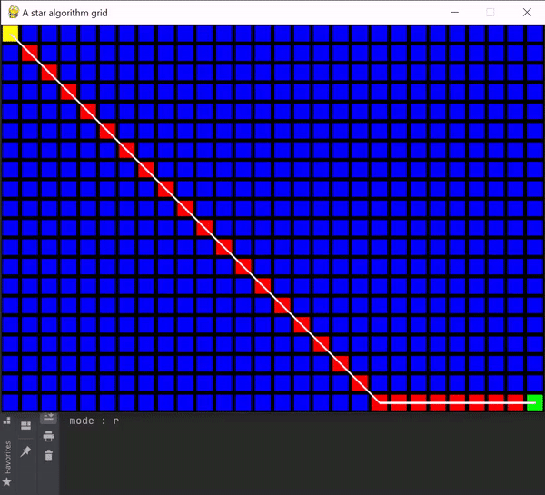

#A star algorithm visualization

--------------------------------------

## Description
A star algorithm based on dijkstra algorithm,
written with Python using PyGame library to implement visualization 

A star algorithm use to find the approximate shortest path between to given points

- yellow block represent the starting point
- green block represent the ending point
- red represent the blocks search by the algorithm
- grey blocks represent walls that the path cannot go throw
- the shortest path marked with white line
--------------------------------------

## Example

--------------------------------------

## How to use
- Press 's' to set Start position
- Press 'e' to set End position
- Press 'w' to set walls positions
- Press 'd' to toggle on/off diagonal path
- Press 'r' to reset the grid

--------------------------------------

## Dependencies
 The project was written with **Python 3.9**.
 
 **Packages used:**
 - PyGame
--------------------------------------
## Running instructions
`pip install -r requirements.txt`